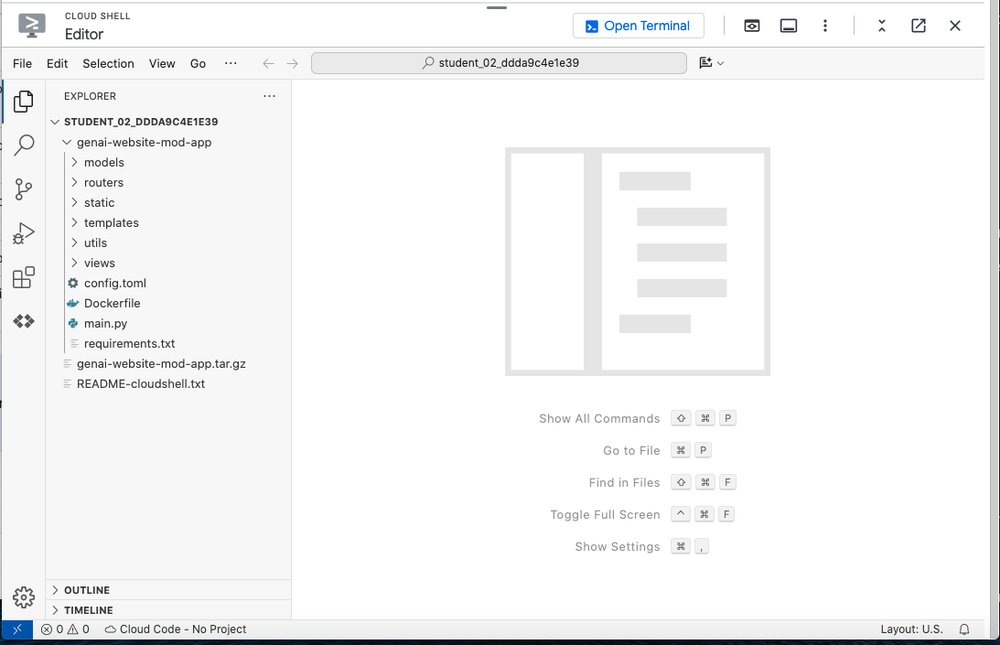
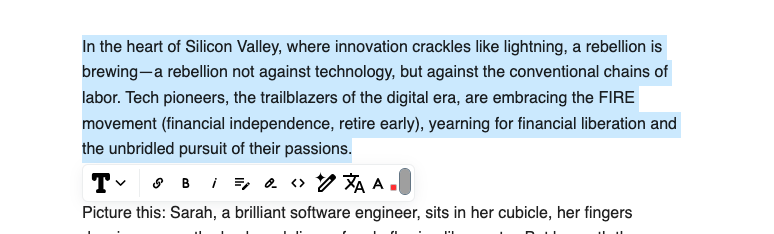
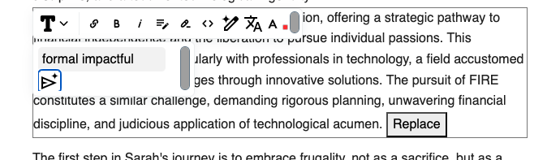
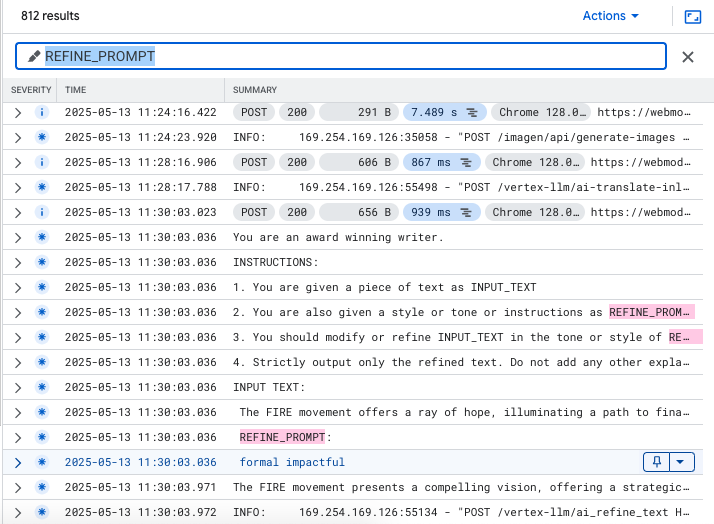

# GCP-LAB-Modernize-your-Website-with-Generative-AI-on-Google-Cloud
Modernize your Website with Generative AI on Google Cloud

##### Overview
Generative AI is a technology that can be used to create content such as text, video, images, and code. Google Cloud offers a variety of large language models (LLMs) and tools to help you get started with GenAI, such as Gemini and Vertex AI. You can use LLM-powered tools to create and enhance content for your websites, and add conversational search experiences. You can also promote web page discovery and enhance website navigation.

Objectives
In this lab, you implement a website modernization solution to:

Streamline content generation using generative AI to enhance the quality and efficiency of website content.
Generate images that complement your written website content.
Seamlessly translate the content into a desired language.
Enhance information discovery by integrating Vertex AI Search into your website.


### Task 1. Enable the Vertex AI API
Before you can use Vertex AI, you must enable the Vertex AI API.

To enable the API, run the command in Cloud Shell:

```
gcloud services enable aiplatform.googleapis.com

```
If prompted, click Authorize.

Note: Before checking your progress, wait for a few seconds for the API to be enabled.


### Task 2. Download the website code
This lab uses a pre-built website app that consists of backend APIs built using FastAPI, and a frontend that is built using html, css, and Javascript. In this task, you download the website code and review the code and file structure.

##### Download and view website code

1. In Cloud Shell, download the website code archive from Cloud Storage:

```
gcloud storage cp gs://cloud-training/OCBL451/genai-website-mod-app.tar.gz .

```
2. Extract the contents of the archive:

```
tar -zxvf genai-website-mod-app.tar.gz

```


3. To view the website code and file structure, in the Cloud Shell menu bar, click Open Editor.

4. In the navigation bar of the Cloud Shell Editor, expand the genai-website-mod-app folder.

This folder contains all the files needed to build and deploy the website app. Here is an overview of the files and their purpose:

| File/Folder |	Description |
| Dockerfile |	Dockerfile to build website application container using Cloud Run |
| config.toml |	Configure application with variables |
| main.py |	Main FastAPI entrypoint to website application |
| models/ |	Folder containing the date models used by the website application |
| routers/ |	FastAPI API routers for different application functionality |
| static/ |	Contains static website assets, such as css, images and JS files |
| templates/ |	Jinja templates for the website application pages |
| utils/ |	Utility modules for the website application |
| views/ |	View implementations of the website application |

>Note: You do not need to view or edit the contents of the files except where noted in later steps of the lab.



### Task 3. Implement Vertex AI Search

In this task, you implement search capability for your website by creating a search application in Vertex AI to search unstructured data such as blog posts.

##### Create a search application

1. In the Google Cloud console, click the Navigation menu (Navigation menu icon), and then select AI Applications.

>Note: If AI Applications is not listed in the navigation menu, click View All Products. In the All Products page, scroll to the section on Artificial Intelligence, and then click AI Applications.

2. Click Continue and activate the API.

3. If you are automatically redirected to the Create App page, go to the next step. Otherwise, click New App.


4. On the Create App page, under Search for your website, click Create.

5. On the Configuration page, configure a generic search app according to these settings, leaving the remaining settings as their defaults:

| Property	| Value (type or select) |
| Your app name	| my-search-app |
| External name of your company or organization |	my-company |
| Location of your app	| global (Global) |

6. Click Continue.

##### Create a data store for the search app

1. Click Create Data Store.

On this page, you configure your search app with your own data source to be used in your website search results.

2. Select Cloud Storage.


>Note: For the purpose of this lab, a few HTML documents that represent blog posts have been pre-provisioned in a Cloud Storage bucket in your project.

3. With Folder selected as the default, click Browse.

4. To view the contents of the Cloud Storage bucket qwiklabs-gcp-00-e69db5742c22-cymbal-frontend, click Button to view contents of Cloud Storage bucket.

5. Select the blog_posts folder, and then click Select.

The gs:// URI to the folder is populated.


6. Click CONTINUE.

7. For the data store name, type my-data-store.

8. Click Create.

9. Click CREATE to create a search application.

10. To navigate to the data page for the app, click Data in the AI Applications navigation menu.


The details of your app's data store are displayed.

AI Applications now starts ingesting the blog post HTML data from your Cloud Storage bucket for your search app.

11. To view the status of the data ingestion, on the Data page, click the Activity tab.

The Status column indicates the current status. Once the import process is completed, the column will indicate Import completed.

status indicating data import activity

>Note: The import process takes a few minutes to complete. Wait until the data import process is completed before continuing to the next step.

12. To verify that the documents were imported successfully, click the Documents tab.

##### Test the search app

You can preview the search app by testing its functionality in AI Applications.

1. In the AI Applications navigation menu, click Preview.


2. In the search box, type What is dollar cost averaging and how can it help me? and press Enter.

The app generates a response explaining dollar cost averaging and provides excerpts and links to the relevant files that were imported from Cloud Storage.

>Note: The generic search app uses the default stable model to generate search responses. You can view or modify the search app configuration in the AI Applications > Configurations page in the Google Cloud console.
To verify the objective, click Check my progress.


### Task 4. Integrate the website application with search

With the search app created, you can now integrate the app with your website or application. This lab uses the search API to make calls and receive responses which are displayed on the site. You can also embed a search widget into your website that automatically provides a search bar and an expandable search interface. To learn more about this option, follow the links at the end of the lab to view the documentation.

In this task, you configure the website code to integrate with the search app that you created in the previous task. You then deploy the website application to Cloud Run for testing.

###### Configure the website application

The website application is built using FastAPI, which is a web framework for building APIs in Python. The `genai-website-mod-app/routers` folder contains the router API implementations for various website functionalities such as search.

1. In the Cloud Shell Editor, navigate to the `genai-website-mod-app/routers` folder, and open the file `vertex_search.py`.


This file contains the code that implements the search API calls using the discoveryengine module from the cloud client SDK for Python. The code also uses tomllib, a module in Python that parses configuration files.

2. View the code in the function `trigger_first_search()`.


This function sets up the call to the Discovery Engine API using the path `projects/{project_id}/locations/{datastore_location}/collections/default_collection/dataStores/{datastore_id},` that contains path parameters.

3. To provide values for the path parameters, in the genai-website-mod-app folder, edit the file config.toml.

4. In the [global] section, replace the values of configuration properties as indicated:

| Section |	Property |	Value |
| global |	project_id |	qwiklabs-gcp-00-e69db5742c22 |
| global |	location |	us-central1 |
| global |	datastore_id |	See next step |

5. Replace the value of the datastore_id configuration property with the value of your search app's datastore ID:


a. To obtain the value of datastore_id, navigate to AI Applications in the Google Cloud console, and select Data.

b. Copy and paste the Data store ID value of my-data-store in the config.toml file.

6. Replace additional configuration properties in the relevant config sections as indicated:

| Section	| Property	| Value |
imagen	bucket_name	qwiklabs-gcp-00-e69db5742c22-cymbal-frontend-images
blog	image_bucket	qwiklabs-gcp-00-e69db5742c22-cymbal-frontend-images
blog	blog_bucket	qwiklabs-gcp-00-e69db5742c22-cymbal-frontend


7. Save your changes to the file.


### Task 5. Build, deploy, and test the website on Cloud Run

Cloud Run is a managed compute platform that lets you run application containers on top of Google's scalable infrastructure.

In this task, you build the website application and deploy it to Cloud Run. You also test the search functionality that you integrated into the website.

###### Set up the environment

1. Make sure you are in the website application directory:

```
cd ~/genai-website-mod-app
```

2. Set environment variables for the project ID, region, and website application service:

```
PROJECT_ID=$(gcloud config get-value project)
REGION=us-central1
SERVICE_NAME='webmod-svc' # Name of your Cloud Run service.
echo "PROJECT_ID=${PROJECT_ID}"
echo "REGION=${REGION}"
echo "SERVICE_NAME=${SERVICE_NAME}"
```


##### Build and deploy your app on Cloud Run

1. To build and deploy your app to Cloud Run, run the command:

```
gcloud run deploy "$SERVICE_NAME" \
  --port 8080 \
  --source . \
  --allow-unauthenticated \
  --region $REGION \
  --project $PROJECT_ID

```


2. To create the Artifact Registry Docker repository, type Y

After the service is deployed, a URL to the service is generated in the command output.

###### Test the website's search functionality

1. To test your app on Cloud Run, navigate to the website application's Cloud Run service URL in a separate browser tab or window.


2. In the search box, type What is dollar cost averaging and how can it help me? and press Enter.

3. Verify that the search results are returned and displayed on the website.

>Note: The search result includes an AI response. It is generated from the content in the HTML files in the data store that you provisioned from Cloud Storage for the search app. On occasion, the search result links might not display a snippet even though they link to the related blog post.

>Note: The blog post files that are used by the website are stored as JSON files in a separate production folder in your Cloud Storage bucket. The website application uses EditorJS to render these files as HTML for viewing on the website.

4. Ask a follow-up question by typing Can you use dollar cost averaging with ETFs? in the search box and press Enter.

5. Verify that the search results include an answer to the follow-up question, along with relevant links to the blog posts.

To verify the objective, click Check my progress.


### Task 6. Using GenAI to edit website content

Google's generative AI tools can be used to create and edit website copy or content. In this task, as a website content editor you use these tools to update the text and image content on the website used in this lab.

###### Review image generation code

The website application uses the Imagen API in Vertex AI to generate and update images.

1. In the Cloud Shell Editor, open the config.toml configuration file.

2. Review the configuration properties in the [imagen] section. This section defines properties for the model to use for image generation and captioning, along with some additional properties.

3. In the Cloud Shell Editor, open the file `routers/vertex_imagen.py`.

The different image captioning and modification functions, along with their API routes, are defined in this file.


4. The functions are implemented in the `utils/imagen.py` file. Open this file in the Cloud Shell Editor.

5. View the generate_image() function:


This function uses the vertexai.preview.vision_models.ImageGenerationModel class from the vertexai package in the Python SDK.

This function first loads the image generation model and then generates an image by invoking the generate_images() function on the model passing in your text prompt and other parameters.

###### Update image content

Let's update an image on one of the blog posts on the website.

1. In the top-right corner of your Cymbal Investments website, click All Blogs.

A page with six blog posts is displayed on the website.


>Note: If the initial blog posts are selected by default, click anywhere on the page to de-select them.


2. Click the link to view the first blog post: Unleashing the Techie Within: A Journey to FIRE.


The blog post page contains a header, image, and paragraphs of text.

3. To edit the page contents, in the bottom right, click Edit (edit icon).


4. Hover over the image. Then, to the left of the image, click Click to tune (click to tune).

5. From the Click to tune menu, select Generate.

6. click to tune menu

6. Under the image caption, for Prompt, type `An image of a retired man and woman sitting on a beach enjoying the sunset`. Click Generate.


7. Scroll to the top of the page, and wait for the image to be generated.

A new image is generated, which is then uploaded to your Cloud Storage images bucket. The blog post page is updated with this new image.


###### Translate content

You can translate entire web pages or just pieces of inline text using text generation models. In this subtask, you translate inline text on the website blog page.

1. In the Cloud Shell Editor, open the file `routers/vertex_llm.py`.

The different web page editing and translation functions along with their API routes are defined in this file.

2. Scroll to the bottom of the source file and view the code for the `ai_translate_inline()` function.


This function builds a prompt using the `ai_translate_inline_prompt` configuration property, the user selected text, and the user specified target language. It then invokes the `llm_generate_gemini()` function to generate a response from the model.

Here is the value of the `ai_translate_inline_prompt` configuration property from the config.toml file:

<mark style="background-color: #E6E6FA;">

    You are an award winning writer.

    INSTRUCTIONS:
    1. You are given a piece of text as INPUT_TEXT
    2. You are also given a target language as TARGET_LANGUAGE.
    3. You should translate the INPUT_TEXT into the TARGET_LANGUAGE. 
    4. Strictly output only the translated text. Do not add any other explanation. Do not output the answer in \"\" (double or single quotes)

    INPUT_TEXT:

</mark>


3. To view the `llm_generate_gemini()` function, open the file utils/vertex_llm_utils.py.


This function uses the vertexai.generative_models.GenerativeModel class from the vertexai package in the Python SDK.

This function first loads the gemini-2.0-flash model, and then generates a response by invoking the generate_content() function on the model passing in your text prompt and other parameters.

4. Make sure you are in the edit mode of your website blog page. If not, in the bottom right, click Edit (edit icon).

5. Select any of the text paragraphs, and then click the Translate tool:



6. In the language prompt field, type French, and then click Send.

After a few seconds, the paragraph text is translated in the language you specified, and replaced inline on the page.


###### Update website copy (text content)

You can also use a generative model to refine your website text content.

1. In the file `routers/vertex_llm.py`, view the `ai_refine_text()` function.


This function builds a prompt using the `ai_refine_prompt` configuration property, the user-selected text from the website content, and user input instructions.

Here is the value of the `ai_refine_prompt` configuration property from the `config.toml` file:

<mark style="background-color: #E6E6FA;">
You are an award winning writer.
</mark>

INSTRUCTIONS:
1. You are given a piece of text as INPUT_TEXT
2. You are also given a style or tone or instructions as REFINE_PROMPT.
3. You should modify or refine INPUT_TEXT in the tone or style of REFINE_PROMPT. 
4. Strictly output only the refined text. Do not add any other explanation. Do not output the answer in \"\" (double or single quotes)

INPUT TEXT: 

</mark>

2. Make sure you are in the edit mode of your website blog page. If not, in the bottom right, click Edit (edit icon).

3. Select any of the text paragraphs, and then click the Refine TextTool:


4. To change the tone of the selected text to be more formal and impactful, in the style box, type formal impactful. This value is appended to the prompt as the REFINE_PROMPT string before invoking the model.

5. Click Send.

After a few seconds, a response is generated from the model and displayed on the page in an enclosed box below the original text.

6. View the updated paragraph text and click Replace.



>Note: In some cases, clicking Replace does not insert the updated text. If this occurs, select a different paragraph to test.

>The top bars on the page contain buttons that are reserved for future use, and are shown to indicate how you can build a workflow to save and review website changes with other team members.


7. To view the final value of the prompt, in the Google Cloud console Navigation menu (Navigation menu icon), select Logging > Logs Explorer.


>Note: If Logging is not listed in the navigation menu, click View All Products. In the All Products page, scroll to the section on Observability, and then click Logging.

8. To highlight the relevant log entries, in the results menubar, click Actions > Highlight in results.

9. For Highlight in results, type REFINE_PROMPT



To verify the objective, click Check my progress.
